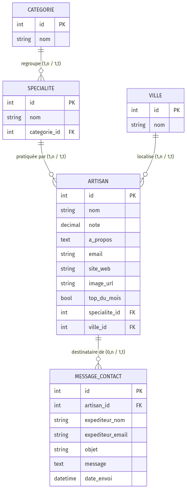
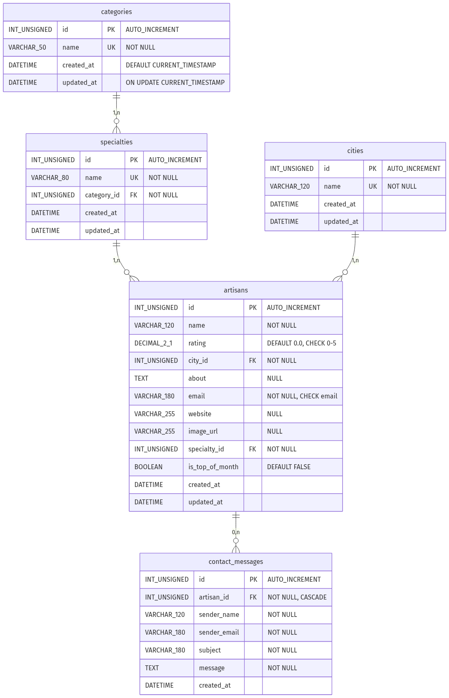

# Base de données — Trouve ton artisan

## 1. Règles de gestion

- **RG1** : Un artisan exerce **une seule** spécialité.
- **RG2** : Une spécialité est rattachée à **une seule** catégorie ; une catégorie regroupe plusieurs spécialités.
- **RG3** : Un artisan est situé dans **une seule** ville ; une ville peut regrouper plusieurs artisans.
- **RG4** : Un artisan peut être mis en avant comme « artisan du mois ».
- **RG5** : Chaque artisan possède une note sur 5 (décimale, de 0 à 5).
- **RG6** : Un message de contact est adressé à **un seul** artisan ; un artisan peut recevoir plusieurs messages.

> **Ville en entité dédiée (3FN)** : la ville est modélisée comme une entité à
> part entière, et non comme un simple attribut de l'artisan. Cela respecte la
> **3ᵉ forme normale** (suppression de la redondance des libellés de villes,
> cohérence garantie des données).

## 2. Modèle Conceptuel de Données (MCD)



Entités et associations (notation Merise) :

- **CATEGORIE** (1,n) ──< _regroupe_ >── (1,1) **SPECIALITE**
- **SPECIALITE** (1,n) ──< _pratiquée par_ >── (1,1) **ARTISAN**
- **VILLE** (1,n) ──< _localise_ >── (1,1) **ARTISAN**
- **ARTISAN** (1,n) ──< _destinataire de_ >── (1,1) **MESSAGE_CONTACT**

## 3. Modèle Logique de Données (MLD)



```
categories       (id, nom)
specialties      (id, nom, #category_id)
cities           (id, nom)
artisans         (id, nom, note, a_propos, email, site_web, image_url,
                  top_du_mois, #specialty_id, #city_id)
contact_messages (id, expediteur_nom, expediteur_email, objet, message,
                  date_envoi, #artisan_id)
```

Conventions : `id` = clé primaire, `#xxx` = clé étrangère.

## 4. Modèle Physique de Données (MPD)

Implémenté sur **MySQL 8 / MariaDB 10** — script complet dans `database/01_schema.sql`.

- Toutes les tables sont en **InnoDB**, jeu de caractères **utf8mb4**.
- **Clés étrangères** :
  - `specialties.category_id` → `categories.id` (`ON DELETE RESTRICT`)
  - `artisans.specialty_id` → `specialties.id` (`ON DELETE RESTRICT`)
  - `artisans.city_id` → `cities.id` (`ON DELETE RESTRICT`)
  - `contact_messages.artisan_id` → `artisans.id` (`ON DELETE CASCADE`)
- **Index** sur les clés étrangères, ainsi que sur `artisans.name` et `artisans.is_top_of_month`.
- **Contraintes CHECK** : `rating` compris entre 0 et 5 ; format de l'`email`.
- **Vue `v_artisans_full`** : jointure artisan + spécialité + catégorie + ville,
  pour simplifier la lecture côté API.

## 5. Jeu d'essai

Fichier `database/02_seed.sql` :

- 4 catégories : Bâtiment, Services, Fabrication, Alimentation
- 15 spécialités
- les villes des artisans (table `cities`)
- 17 artisans, dont 3 marqués « artisan du mois »

Données issues du fichier `data.xlsx` fourni dans le brief.

## 6. Volet NoSQL — collection `reviews` (MongoDB)

En complément de la base relationnelle, les **avis clients** sont stockés dans
une base **MongoDB**, via l'ODM **Mongoose** (modèle
`backend/src/models/Review.js`).

Document type :

```json
{
  "artisanId": 1,
  "authorName": "Claire",
  "rating": 5,
  "comment": "Travail impeccable et très soigné.",
  "reply": { "message": "…", "repliedAt": "…" },
  "createdAt": "…",
  "updatedAt": "…"
}
```

- **Lien SQL ↔ NoSQL** : `artisanId` référence l'identifiant de l'artisan en
  base relationnelle ; le service vérifie l'existence de l'artisan côté SQL
  avant toute écriture côté MongoDB.
- **Validation** : le schéma Mongoose contrôle types, champs obligatoires et
  bornes (note de 1 à 5, longueurs minimales/maximales).
- **Index** : un index sur `artisanId` accélère la lecture des avis d'un
  artisan ; la note moyenne est calculée par une agrégation MongoDB.
- **Résilience** : la connexion est non bloquante — sans MongoDB, l'API SQL
  fonctionne et les routes d'avis répondent 503.
